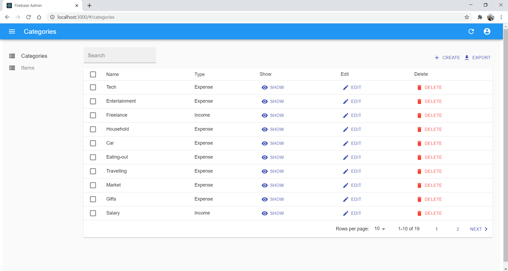

A simple Firebase Collection CRUD Management project.

### Main Packages
- react
- react-admin
- firebase
- react-admin-firebase

### Screenshot


### Installation

1. Install node modules.
```bash
$ npm install
```
2. Update `firebaseConfig.js` file at src/config folder with your own configuration
```js
export default {
  apiKey: "",
  authDomain: "",
  databaseURL: "",
  projectId: "",
  storageBucket: "",
  messagingSenderId: "",
  appId: "",
  measurementId: ""
};
```
3. Start Project
```bash
$ npm run start
```

